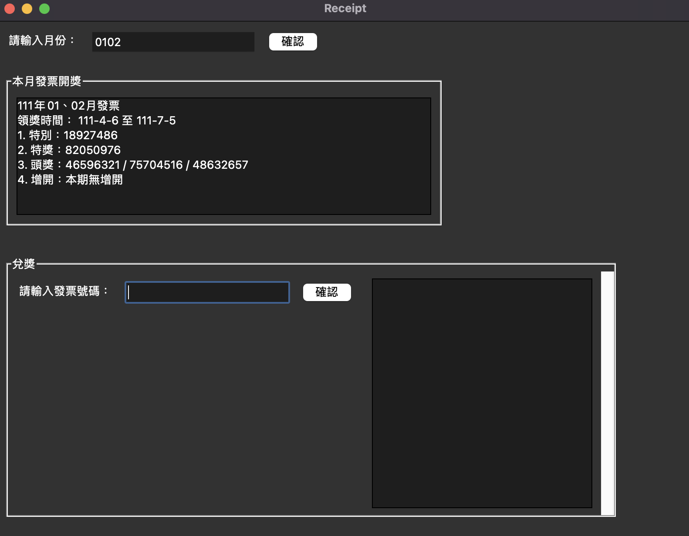

# **uniform-invoice-app**

Uniform invoice app is a Streamlit application that allows users to check Taiwan uniform invoice numbers.

<p align="center">
    
</p>

## **Documentation**
### 1. Installation
- Python version: >= 3.6
- Clone repository
  ```bash
  git clone git@github.com:Retr0327/uniform-invoice-tkinter-app.git
  ```

- Install Requirement
  ```bash 
  cd invoiceapp && pip install -r requirement.txt      
  ```

### 2. Start the app
Just simply run:
  ```bash 
  python3 invoiceapp start
  ```


## Contact Me
If you have any suggestion or question, please do not hesitate to email me at r07142010@g.ntu.edu.tw
