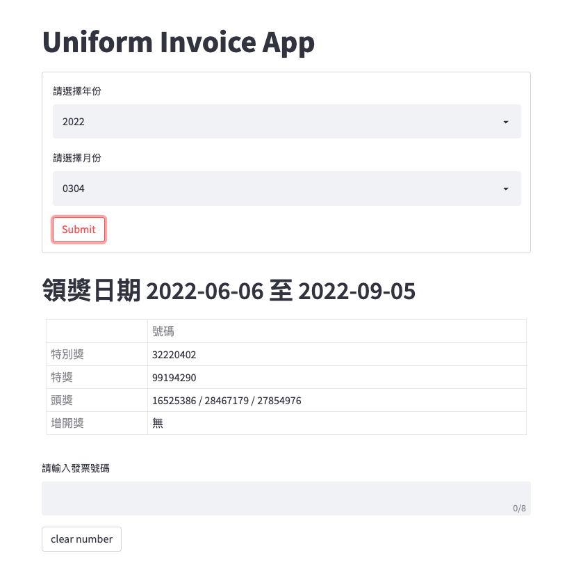

# **uniform-invoice-app**

Uniform invoice app is a Streamlit application that allows users to check Taiwan uniform invoice numbers.

<p align="center">
    
</p>

## **Documentation**
### 1. Installation
- Python version: >= 3.9
- Clone repository
  ```bash
  git clone git@github.com:Retr0327/uniform-invoice-tkinter-app.git
  ```

- Install Requirement
  ```bash 
  cd uniform-invoice-app && pip install -r requirement.txt      
  ```

### 2. Start the app
There are two main ways to run the app:

- run in Python 

  First make sure you are in the `uniform-invoice-app` folder, and then simply run:
  ```bash 
  streamlit run src/app.py
  ```

- run in Docker
  
  Install Docker, and user the following command to run:
  
  ```bash
  docker compose up
  ```

  Then acces `http://localhost` in the browser.

## Contact Me
If you have any suggestion or question, please do not hesitate to email me at r07142010@g.ntu.edu.tw
